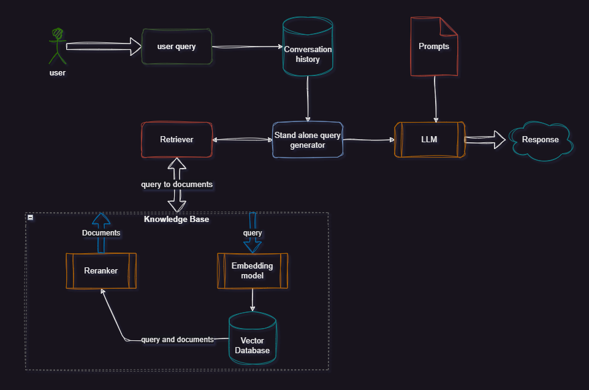
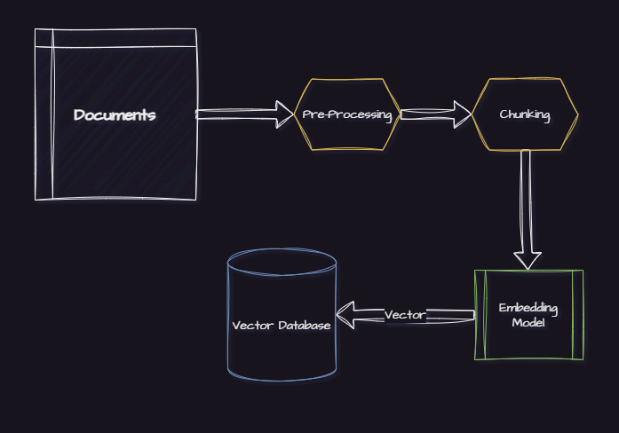
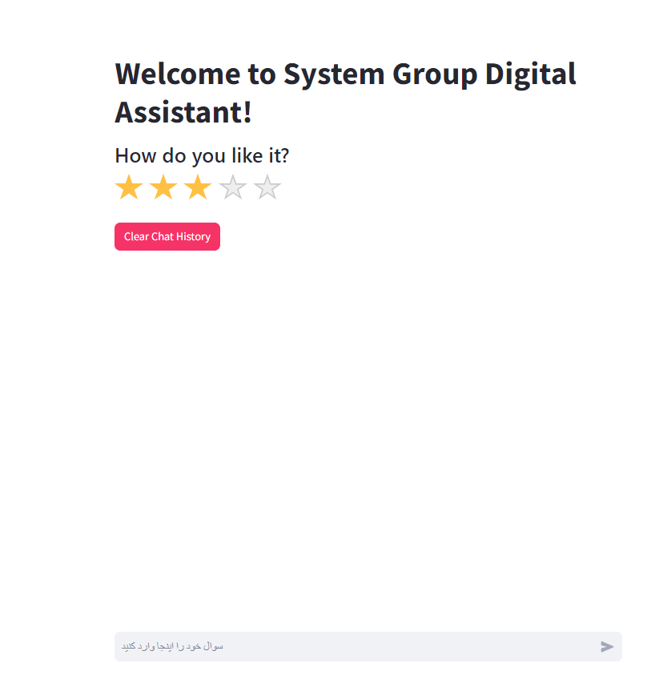

# SystemGroupAssistantBot - RAGBOT
Python implementation for SG Digital Assistant RAGBot. In the following diagram you can see how this chatbot works:

# How to run SG Ragbot:

0. Clone the project ``git clone https://github.com/naserahmadi/SystemGroupAssistantBot.git`` and ``cd Rag-Bot``
1. Install the requirements by runnnig ``pip install -r requirements.txt``
2. Initiate vector DB with this command: ``bash initiate_db.sh``. Knowledge base and vector database will be created with a process like below: 

3. Run the app: ``bash run_app.sh``. The app will run on port 8504 of your localhost. 

# How to run evaluations:
- For running the evaluations, first config your evaluations in ``rag-configs.yaml`` and then run the ``ragbot/eval.py`` script. 
- This script will run the evaluation on the selected dataset and will save the results in ``evaluation`` folder.  